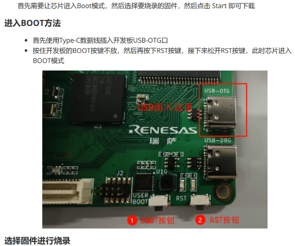
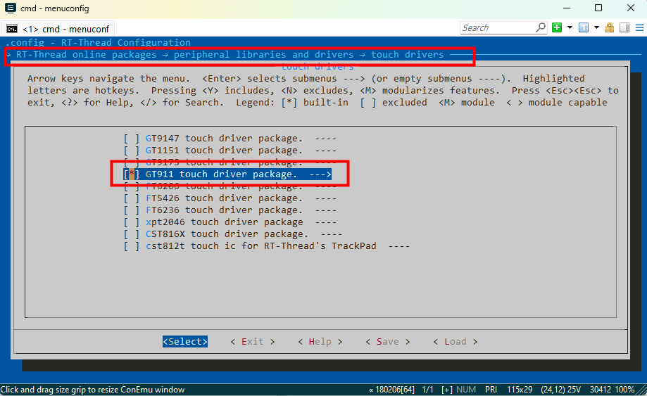

# vision_board_rgb_4.3inch_480x272 示例说明

## 简介

本例程主要功能是测试 4.3 寸 RGB屏幕，通过测试命令可以在 LCD 屏幕上显示不同颜色。

## 硬件说明

* Vision-Board 开发板
* 4.3寸 480x272分辨率的RGB屏幕


RGB接口引脚定义如上图所示，需要将4.3寸屏幕通过FPC反接排线插入 Vision-Board 的正面RGB接口中，接线方式见下图：


## 软件说明

触摸部分的代码位于 `/projects/vision_board_rgb_4.3inch/src/hal_entry.c` 中。在 hal_entry 中主要对RGB屏幕进行了初始化，并单独开辟了一个线程用于测试读取触摸坐标点。

## 运行

### 编译&下载

#### MDK 方式

1、双击 `mklinks.bat` 文件，执行脚本后会生成 `rt-thread`、`libraries` 两个文件夹：


2、编译固件

双击 **project.uvprojx** 文件打开MDK工程


点击下图按钮进行项目全编译：


3、烧录固件

将开发板的 Dap-Link USB 口与 PC 机连接，然后将固件下载至开发板。


## 运行效果

* 打开 Dap-Link 虚拟出的串口终端，波特率为115200，当用手触摸显示屏时，坐标点位会在串口终端中显示。
* 串口终端中输入 `lcd_test` 指令后，LCD会以红、绿、蓝三个颜色分别刷新显示。
* 串口终端中输入 `gt911_register` 指令后，可以进行触摸报点测试，程序会在串口终端打印触摸的坐标点（**前提触摸屏为 GT911触摸IC**）。

## QA

Q：遇到在使用 Dap-Link 时找不到目标芯片的情况并且无法下载：


A1：方法一：**由于 JTAG/SWD 在芯片出厂时首次使用是加锁的**。请按住开发板的RST按键（正面右一）不松手。再次点击MDK下载按钮后，快速松开RST按键即可。后续无需重复以上操作。

A2：方法二：使用  [Renesas Flash Programmer](https://www.renesas.com/us/en/software-tool/renesas-flash-programmer-programming-gui#documents) 烧录工具进行第一次烧录，操作方法如下：




## 补充说明：

## 修改屏幕分辨率操作如下：

- 1.在FSP 配置工具中选择LCD屏Stacks，修改Graphics Layer1 的分辨率为480x272.


- 根据屏参修改参数


- 点击生成代码


- 在drv_lcd.c 文件中添加屏的打点测试代码，确认屏参配置正常.

  ```c
  #include <stdlib.h>
  static int lcd_draw_point(int args,char *argv[])
  {
  	  struct drv_lcd_device *lcd;
      struct rt_device_rect_info rect_info;
      rect_info.x = 0;
      rect_info.y = 0;
      rect_info.width = LCD_WIDTH;
      rect_info.height = LCD_HEIGHT;
  
      lcd = (struct drv_lcd_device *)rt_device_find("lcd");
  	
  	rt_kprintf("lcd_draw_point LCD_WIDTH:%d LCD_HEIGHT=%d \r\n",LCD_WIDTH,LCD_HEIGHT);
  		
  	 int x = 0;
  	 int y = 0;
  	 int i, k;
  
  
  	
  	 x = atoi(argv[1]);
  	 y = atoi(argv[2]);
  	
  	rt_kprintf("input  is x:%d,y:%d\n",x,y);
  	 
  	  if(x >= LCD_WIDTH)   x = LCD_WIDTH  - 1;
      if(y >= LCD_HEIGHT)  y = LCD_HEIGHT - 1;
      if (x < 0) x = 0;
      if (y < 0) y = 0;
  
      rt_kprintf("Darw point is x:%d,y:%d\n",x,y);
  		
  		for (i = y - 2; i < y + 2; i++)
      {
          if (i < 0) continue;
          if (i >= LCD_HEIGHT) break;
          for (k = x - 2; k < x + 2; k++)
          {
              if (k < 0) continue;
              if (k >= LCD_WIDTH) break;
  
  					*((uint16_t *)lcd->lcd_info.framebuffer + LCD_WIDTH * i + k) = 0xF800;
          }
      }
  		
  		lcd->parent.control(&lcd->parent, RTGRAPHIC_CTRL_RECT_UPDATE, &rect_info);
  
  
  	
  	
  }
  MSH_CMD_EXPORT(lcd_draw_point,draw a point on lcd);
  ```

  ```shell
  msh >lcd_draw_point 0 0
  lcd_draw_point LCD_WIDTH:480 LCD_HEIGHT=272 
  input  is x:0,y:0
  Darw point is x:0,y:0
  msh >lcd_draw_point 480 272
  lcd_draw_point LCD_WIDTH:480 LCD_HEIGHT=272 
  input  is x:480,y:272
  Darw point is x:479,y:271
  msh >
  ```

  这时候会在屏幕的左上角和右下角显示2个红色块，证明屏幕分辨率配置成功。

## 触摸功能修改为GT911 的软件包操作步骤

  由于LCD 工程默认是触摸芯片是GT9147 的，实际 480X272 的屏幕上是GT911 的触摸芯片，所以这部分需要适配。

- 在env 工具的终端中输入 `menuconfig`勾选 `GT911`软件包，然后保存并退出。

  

  

- 在env 工具的终端中输入`pkgs --update`命令下载`GT911`软件包。

  

- 在env 工具的终端输入`scons --target=mdk5`命令重新生成MDK 工程

  

  

- MDK 工程编译会提示一个错误，需要把  `gt911.c` 文件的`memcpy`修改为`rt_memcpy`

  

  

- 修改 MDK 工程中的`hal_entry.c`文件,主要把`gt9147`相关的变量修改为`gt911`的名称，具体可以看工程里面的hal_entry.c 文件。

- MDK 工程编译烧录到板子后，在串口终端输入`gt911_register`命令后，点击屏幕会打印相关坐标点信息。

  

  ```c
  坐标点说明：
  0 8 6 38584 0
  0 ：read_data->track_id 
  8 ：read_data->x_coordinate 触摸屏的 X 坐标
  6 ：read_data->y_coordinate 触摸屏的 Y 坐标
  38584：read_data->timestamp 时间戳
  0：read_data->width 
  ```

